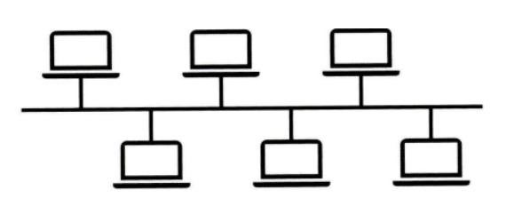
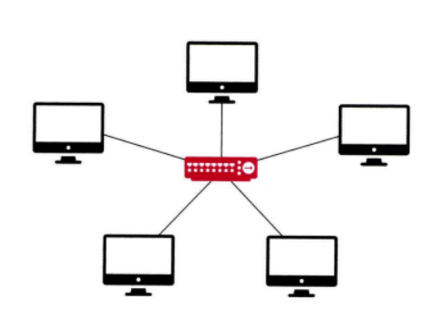
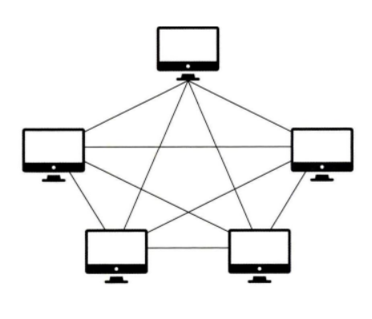

# 2.1 네트워크의 기초
네트워크 : 노드(node)와 링크(link)가 서로 연결되어 리소스를 공유하는 집합
* 노드 : 네트워크 장치(서버, 라우터, 스위치)
* 링크 : 유선 또는 무선
## 2.1.1 처리량과 지연 시간
좋은 네트워크 
처리량⬆️, 지연시간⬇️, 장애 빈도⬇️, 좋은 보안을 가진 것 

---
## **처리량 Throughput**
링크를 통해 전달되는 단위시간당 데이터의 양

✔️ 많은 트래픽을 처리한다 = 많은 처리량을 가진다

*처리량의 단위*
bps(bits per second) : 초당 전송 또는 수신되는 비트 수  
더 많은 처리량 → Mbps(megabits), Gbps(Gigabits)  
* 처리량에 영향을 주는 요소
    * 사용자 접속시 증가하는 트래픽
    * 네트워크 장치 간의 대역폭
    * 네트워크 도중 발생하는 에러
    * 장치의 하드웨어 스펙

트래픽 : 특정 시점에 링크 내에 '흐르는' 데이터의 양

대역폭 : 네트워크 연결 중 단위 시간 내 전달될 수 있는 최대 비트 수

## **지연 시간 latency**
요청이 처리되는 시간, 어떤 메시지가 두 장치 사이를 왕복하는 데 걸린 시간
* 매체 타입(무선, 유선), 패킷 크기, 라우터의 패킷 처리 시간에 영향을 받음

## 2.1.2 네트워크 토폴로지와 병목 현상
### **네트워크 토폴로지 network topology**
노드와 링크가 어떻게 배치되어 있는 지에 대한 방식이자 연결 상태

**트리 토폴로지**  

* 계층형 토폴로지
* 트리 형태로 배치한 네트워크 구성
* 장점 : 노드의 추가/ 삭제가 쉬움
* 단점 : 특정 노드에 트래픽이 집중될 때 하위 노드에 영향을 끼침

**버스 토폴로지**  

* 중앙 통신 회선 하나에 여러 개의 노드가 연결되어 공유하는 네트워크 구성
* 장점 : 신뢰성 우수, 설치 비용 적음. 중앙 통신 회선에 노드 추가/삭제가 쉬움
* 단점 : 스푸핑 가능  
*스푸핑*  
LAN상에서 송신부의 패킷을 송신과 관련 없는 다른 호스트에 가지 않도록 하는 스위칭 기능을 마비시키거나 속여서 특정 노드에 해당 패킷이 오도록 처리하는 것
    * ARP 스푸핑 : MAC 주소를 속여 랜에서의 통신 흐름을 왜곡시키는 공격. 공격 대상 컴퓨터와 서버 사이의 트래픽을 공격자의 컴퓨터로 우회, 패스워드 정보 등 원하는 정보를 획득함
    * IP 스푸핑 : IP자체의 보안 취약성을 악용, 자신의 IP주소를 속여서 접속하는 공격, DoS(서비스 거부 공격)도 수행 가능, 공격 대상 컴퓨터와 서버 사이의 세션도 끊을 수 있음
    ➡️ 종단 인증 방식으로 해결 가능(추가 공부 필요)
    * DNS 스푸핑 : DNS는 인터넷 연결 시 도메인 주소를 실제 IP주소로 대응시켜주는 프로토콜,  
    공격자가 DNS서버를 장악하거나 사용자와 DBS사이의 트래픽을 스니핑하여 공격자가 설정한 임의의 IP주소를 사용자에게 보내 원하는 사이트로 이동시키는 공격

**스타 토폴로지**  

* 중앙에 있는 노드에 모드 연결된 구성
* 장점 : 노드 추가 용이, 에러 탐지 쉬움, 패킷 충돌 발생 가능성이 적음, 노드에서 장애 발생시 발견하기 쉬움, 장애 노드가 중앙 노드가 아닐 경우, 타 노드에 영향⬇️
* 단점 : 중앙 노드에 장애 발생시 전체 네트워크에 영향을 끼침, 설치 비용 고가

**링형 토폴로지**  

* 각각의 노드가 양 옆의 두 노드와 연결되어 고리모양처럼 생긴 구성
* 하나의 연속된 길을 통해 통신➡️고리 모양의 길을 통해 패킷을 처리함
* 장점 : 노드 수가 증가해도 네트워크상 손실이 없음. 충돌이 발생할 가능성⬇️, 고장 발견 쉬움
* 단점 : 네트워크 구성 변경 어려움, 한 노드 및 회선에서 장애 발생➡️전체 네트워크에 영향

**메시 토폴로지**  

* 망형 토폴로지
* 장점 : 한 노드에서 장애 발생해도 정상 운영 가능⬅️경로가 여러 개이기 때문 / 트래픽 분산 처리 용이
* 단점 : 노드 추가/ 제거 어려움, 구축, 운용 비용 비쌈

### **병목현상 bottlenck**
전체 시스템의 성능이나 용량이 하나의 구성 요소로 인해 제한을 받는 현상(병 몸통보다 병의 목이 좁아 물이 상대적으로 천천히 쏟아지는 것) ➡️ 서비스에서 이벤트를 열었을 때 트래픽이 ⬆️ > 이를 잘 관리해야함  

### 2.1.3 네트워크 분류
기준 : 규모  

**PAN(Personal area network)**
* 가장 작은 규모의 네트워크

**LAN(local area network)**
* 근거리 네트워크, 같은 건물, 캠퍼스와 같은 좁은 공간에서 운영
* 전송속도가 빠르고 혼잡하지 않음

**MAN(Metropolitan area network)**
* 대도시 영역 네트워크, 도시 같은 넓은 지역 운영
* 전송 속도 평균, LAN보다는 혼잡

**WAN(Wide area network)**
* 광대역 네트워크, 국가 또는 대륙 같은 더 넓은 지역에서 운영
* 전송 속도는 낮으며, MAN보다 혼잡

**VAN(Value Added network)**
* 부가가치 통신망
* 공중 통신 사업자로부터 통신 회선을 임대하여 하나의 사설망을 구축하고, 이를 통해 정보의 축적, 가공, 변환 처리 등 부가 가치를 첨가한 후 불특정 다수를 대상으로 서비스를 제공하는 통신망

**ISDN (Integrated Services Digital Network)**
* 종합정보 통신망(=BISDN) 전화, 팩스, 데이터 통신, 비디오텍스 등 통신관련 서비스를 종합하여 다루는 통합서비스 디지털 통신망
 * 디지털 전송방식과 광섬유 케이블 사용. 꿈의 통신망이라 불림

### 2.1.4 네트워크 성능 분석 명령어  
코드 상에는 문제가 없는데, 사용자가 서비스로부터 데이터를 가져오지 못하는 상황이 발생➡️네트워크 병목 현상일 가능성이 있음

**병목 현상의 원인**
* 네트워크 대역폭
* 네트워크 토폴로지
* 서버 CPU, 메모리 사용량
* 비효율적인 네트워크 구성(토폴로지)

네트워크로부터 발생한 문제점인 것이 확인된다면, 명령어를 통한 네트워크 분석이 필요함

**ping**
*Packet INternet Groper*  
대상 컴퓨터를 향해 일정 크기의 패킷을 보낸 후, 대상 컴퓨터가 이에 대한 응답 메세지를 보내면 이를 수신하여 대상 컴퓨터 동작 여부, 네트워크 상태를 파악할 수 있는 명령어
* 해당 노드의 패킷 수신 상태와, 도달하기까지의 시간 등을 알 수 있음
* 해당 노드까지 네트워크가 잘 연결되어 있는지 확인할 수 있음
* ICMP 프로토콜을 통해 동작함
*ICMP 프로토콜 : TCP/IP에서 IP패킷을 처리할 때 발생되는 문제를 알려주는 프로토콜*
IP는 오로지 전송만 하는 프로토콜, 정상적으로 목적지 호스트로 도달하는 경우 IP에서 통신이 성공하고 

**netstat**
*network statistics*
접속되어 있는 서비스들의 네트워크 상태를 표시할때 사용되는 명령어
* 네트워크 접속, 라우팅 테이블, 네트워크 프로토콜 등 리스트를 보여줌
* 주로 서비스의 포트가 열려 있는지 확인할 때 씀

**nslookup**
*name server lookup*
DNS 서버와 관련된 정보를 확인하는 명령어
* 특정 도메인에 대한 매핑된 IP확인

**tracert(linux:traceroute)**
*Trace Route*
지정된 호스트에 도달할 때까지 통과하는 경로의 정보와 각 경로에서의 지연 시간을 추적하는 네트워크 명령어
* 목적어 노드까지 네트워크 경로를 확인할 때 사용
* 특정 사이트에 접속이 되지 않거나 지연이 있는 경우 어디에서 병목이 발생하는지를 알아보는데 유용함