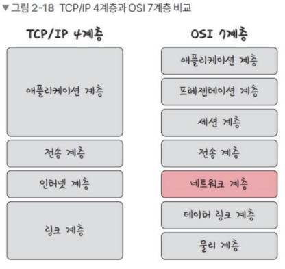
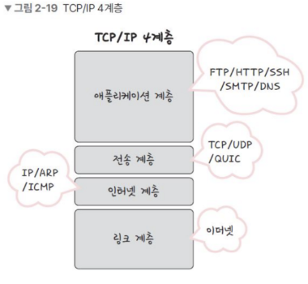

# 2.2 TCP/IP 4계층 모델
### 인터넷 프로토콜 스위트  
인터넷에서 컴퓨터들이 서로 정보를 주고 받는데 쓰이는 프로토콜의 집합 ➡️ **TCP/IP 4계층 모델 또는 OSI 7계층 모델로 설명 가능**
## 2.2.1 계층 구조

* 공통점
    * 특정 계층이 변경되었을 때 다른 계층이 영향 받지 않음 ➡️ 상호독립적으로 유연하게 설계됨
* TCP/IP 4계층과 OSI 7계층 차이점  
    * 계층 세분화  
    TCP/IP ➡️ OSI  
애플리케이션 ➡️ 애플리케이션, 프레젠테이션, 세션
링크 ➡️ 데이터 링크, 물리
    * 이름 변경  
    TCP layer 2 인터넷 | OSI layer 3 네트워크

## **4계층 - 애플리케이션**
* FTP, HTTP, SSH, SMTP, DNS 등 응용 프로그램이 사용되는 프로토콜 계층
* 웹 서비스, 이메일 등 서비스를 실질적으로 사람들에게 제공함

> *protocol*
* FTP : 장치와 장치 간의 파일을 전송하는 데 사용되는 표준 통신 프로토콜
* SSH : 보안되지 않은 네트워크에서 네트워크 서비스를 안전하게 운영하기 위한 암호화 네트워크 프로토콜
* HTTP : WWW(World Wide Web)상의 하이퍼텍스트 형태의 문서를 전달하는 데 주로 사용되는 프로토콜, 현재는 이미지, 비디오, 음성 등 거의 모든 형식의 데이터 전송 가능
    * 클라이언트-서버 모델 사용
    * 메세지 교환 형태의 프로토콜
    * 비연결성, 비신뢰성 ➡️ 오직 전송만을 위한 프로토콜임
* SMTP : 전자 메일 전송을 위한 인터넷 표준 통신 프로토콜
* DNS : 도메인과 ip주소를 매핑해주는 서버, ip주소가 바뀌어도 사용자들에게 똑같은 도메인 주소로 서비스 가능하게 해주는 프로토콜

## **3계층 - 전송**
* **TCP, UDP**
* 송신자-수신자 사이의 통신을 지원하는 계층
* 데이터 스트림 지원, 신뢰성, 흐름 제어를 제공
* 애플리케이션과 인터넷 계층 사이 데이터가 전달될 때 중계 역할을 함
* 종단간(end-to-end) 통신을 다루는 최하위 계층으로 종단간 신뢰성 있고 효율적인 데이터를 전송

### TCP 프로토콜 (Transsmission Control Protocol)
* 양종단 호스트 내 프로세스 상호 간에 신뢰적인 연결지향성 서비스를 제공함
* 신뢰적인 전송 보장(IP계층의 비신뢰성때문)  
    * 신뢰성있는 전송이란?  
패킷 손실, 중복, 순서바뀜 등이 없도록 보장해준단 뜻
* 연결지향적 (Connection-oriented) : 연결 관리를 위한 연결 설정 및 연결 해제 필요
