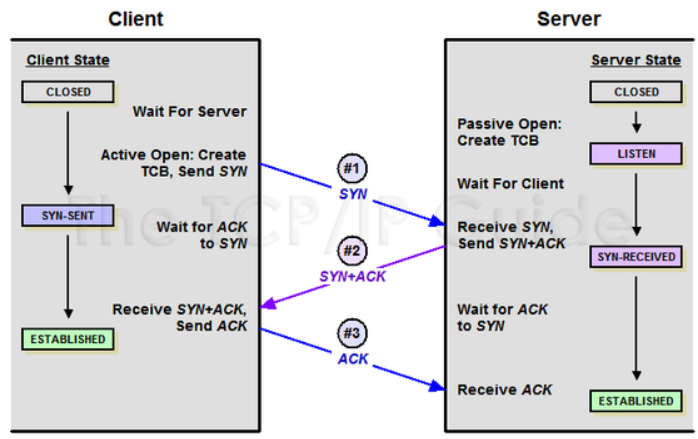
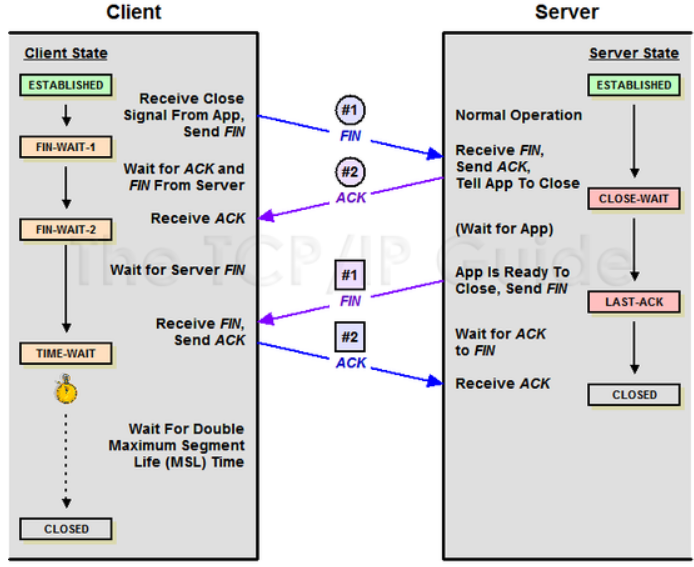
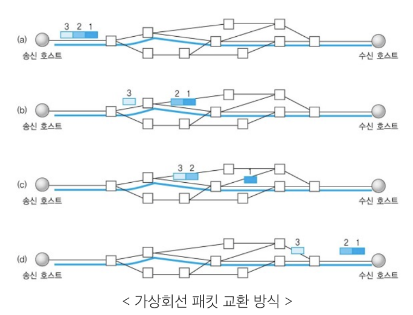
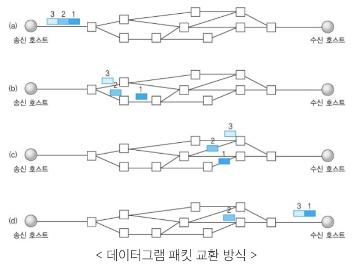

# 2.2 TCP/IP 4계층 모델
### 인터넷 프로토콜 스위트  
인터넷에서 컴퓨터들이 서로 정보를 주고 받는데 쓰이는 프로토콜의 집합 ➡️ **TCP/IP 4계층 모델 또는 OSI 7계층 모델로 설명 가능**
## 2.2.1 계층 구조

* 공통점
    * 특정 계층이 변경되었을 때 다른 계층이 영향 받지 않음 ➡️ 상호독립적으로 유연하게 설계됨
* TCP/IP 4계층과 OSI 7계층 차이점  
    * 계층 세분화  
    TCP/IP ➡️ OSI  
애플리케이션 ➡️ 애플리케이션, 프레젠테이션, 세션
링크 ➡️ 데이터 링크, 물리
    * 이름 변경  
    TCP layer 2 인터넷 | OSI layer 3 네트워크

## **4계층 - 애플리케이션**
* FTP, HTTP, SSH, SMTP, DNS 등 응용 프로그램이 사용되는 프로토콜 계층
* 웹 서비스, 이메일 등 서비스를 실질적으로 사람들에게 제공함

> *protocol*
* FTP : 장치와 장치 간의 파일을 전송하는 데 사용되는 표준 통신 프로토콜
* SSH : 보안되지 않은 네트워크에서 네트워크 서비스를 안전하게 운영하기 위한 암호화 네트워크 프로토콜
* HTTP : WWW(World Wide Web)상의 하이퍼텍스트 형태의 문서를 전달하는 데 주로 사용되는 프로토콜, 현재는 이미지, 비디오, 음성 등 거의 모든 형식의 데이터 전송 가능
    * 클라이언트-서버 모델 사용
    * 메세지 교환 형태의 프로토콜
    * 비연결성, 비신뢰성 ➡️ 오직 전송만을 위한 프로토콜임
* SMTP : 전자 메일 전송을 위한 인터넷 표준 통신 프로토콜
* DNS : 도메인과 ip주소를 매핑해주는 서버, ip주소가 바뀌어도 사용자들에게 똑같은 도메인 주소로 서비스 가능하게 해주는 프로토콜

## **3계층 - 전송**
* **TCP, UDP**
* 송신자-수신자 사이의 통신을 지원하는 계층
* 데이터 스트림 지원, 신뢰성, 흐름 제어를 제공
* 애플리케이션과 인터넷 계층 사이 데이터가 전달될 때 중계 역할을 함
* 종단간(end-to-end) 통신을 다루는 최하위 계층으로 종단간 신뢰성 있고 효율적인 데이터를 전송
### UDP 프로토콜 (User Datagram Protocol)
* 비연결성, 비신뢰성, 비순서화된 Datagram서비스 제공
* 실시간 애플리케이션 및 멀티캐스팅 가능
    * 빠른 요청과 응답이 필요한 실시간 애플리케이션에 적합함
    * 여러 다수 지점에 전송 가능 (1:다)
* 헤더가 단순함
    * TCP와 가이 16비트의 포트 번호를 사용하나, 헤더는 고정크기의 8바이트(TCP:20)만 사용➡️헤더 처리에 많은 시간과 노력을 요하지 않음
### TCP 프로토콜 (Transsmission Control Protocol)
* 양종단 호스트 내 프로세스 상호 간에 신뢰적인 연결지향성 서비스를 제공함
    * 신뢰적인 전송 보장(IP계층의 비신뢰성때문)  
        * 신뢰성있는 전송이란?  
패킷 손실, 중복, 순서바뀜 등이 없도록 보장해준단 뜻 <- 3-way handshaking
    * 연결지향적 (Connection-oriented) : 연결 관리를 위한 연결 설정 및 연결 해제 필요
* ### 3-Way handshaking
*TCP의 신뢰성 보장 연결 작업, TCP의 연결 초기화시 사용*

**1. SYN 단계**  
`Client ➡️ Server : TCP SYN`
클라이언트는 접속을 요청하는 SYN 패킷을 서버에게 보냄, SYN을 보낸 클라이언트는 SYN/ACK 응답을 기다리는 SYN_SENT 상태가 됨  
**2. SYN + ACK 단계**  
`Server ➡️ Client : TCP SYN ACK`  
서버는 SYN 요청을 받고 클라이언트에게 요청을 수락한다는 ACK와 SYN flag가 설정된 패킷을 발송,  
다시 클라이언트의 응답을 기다림. 서버는 SYN_RECEIVED 상태  
**3. ACK 단계**
`Client ➡️ Server : TCP ACK`  
클라이언트가 서버에게 ACK을 보내면 연결이 이루어짐. (서버, 클라이언트 : ESTABLISHED 상태)  
> SYN : SYNronization의 약자, 연결 요청 플래그  
ACK : ACKnowledgement의 약자, 응답 플래그  
ISN : Initial Sequence Numbers의 약어, 초기 네트워크 연결할때 할당된 32비트 고유 시퀀스 번호
* ### 4-Way handshaking

*TCP 연결 해체 과정(세션 종료시 사용)*  
**1** 
`Client ➡️ Server : FIN`  
클라이언트가 서버에게 연결을 종료하겠다는 FIN 플래그 전송, 클라이언트는 FIN-WAIT-1 상태가 됨  
**2**
`Server ➡️ Client : ACK`  
서버가 ACK로 응답 후 서버는 CLOSE_WAIT 상태가 되어 통신이 끝날때까지 기다림  
클라이언트는 ACK 신호를 받은 후, FIN-WAIT-2 상태가 됨  
**3**
`Server ➡️ Client : FIN`  
시간이 지난 후 서버가 통신이 끝났다는 FIN 플래그를 전송함  
**4**
`Client ➡️ Server : ACK`  
클라이언트는 TIME-WAIT상태가 됨, 다시 서버에게로 ACK 신호를 보내 서버도 CLOSED상태가 됨  
이후, 클라이언트는 어느 시간 정도 대기한 후, 연결이 닫히고 클라이언트와 서버의 모든 자원의 연결이 해제됨.

**TIME-WAIT 시간을 가지는 이유**  
1. 지연 패킷이 발생할 경우 :  
Server에서 FIN을 전송하기 전에(3단계 전) 전송한 패킷이 Routing 지연이나 패킷 유실로 인한 재전송 등으로 인해 FIN패킷(3단계)보다 늦게 도착하는 상황이 발생할 수 있음 ➡️ 해당 패킷은 Drop, 유실됨.  
이를 대비하여 Client는 FIN신호를 받더라도 일정시간동안 세션을 남겨놓고 잉여 패킷을 기다리는 TIME-WAIT 과정을 거치게 됨. 우분투는 60초, 윈도우는 4분.
2. 두 장치의 연결이 잘 닫혔는지 확인하기 위함
LAST_ACK 상태에서 닫히게 되면 다시 새로운 연결을 하려고 할때 접속 오류가 발생할 수 있음
### TCP vs UDP

* 가상회선 패킷 교환 방식 : TCP  
가상회선 :  데이터를 전송하기 전에 설정되는 논리적 연결(연결지향형) 
    * 각 패킷에는 가상회선 식별 번호(VCI) 포함되어 전송, 모든 패킷 전송 후 가상회선 해제, 패킷은 전송된 **순서대로** 도착
    * 라우터가 경로를 선택하는 것이 아니라 경로를 설정할때 한 번만 수행됨  

* 데이터그램 패킷 교환 방식 : UDP  
데이터그램 : 데이터를 전송하기 전에 논리적 연결이 설정되지 않으며 패킷이 독립적으로 전송되는 것
    * 패킷을 수신한 라우터는 최적의 경로를 선택하여 **패킷을 독립적으로 전송**
    * 하나의 메시지에서 분할된 여러 패킷은 서로 다른 경로로 전송될 수 있음(비연결 지향형)
    * 송신한 순서 != 수신 도착 순서

가상 회선 방식 : 정해진 시간 안, 다량의 데이터 연속으로 보낼 때 적합
데이터그램 방식 : 짧은 메시지의 일시적인 전송에 적합